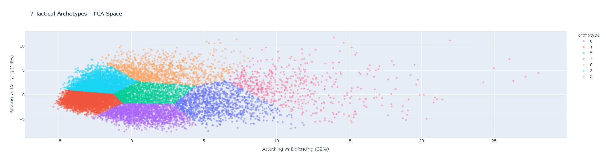

# Football Tactical Fingerprint

## Live Demos

| App | Description | Link |
|-----|-------------|------|
| **Main App** | Player search, PCA visualization, and archetype explorer | [Launch Main App](https://football-tactical-fingerprint.streamlit.app) |
| **AI Assistant** | Ask questions about player archetypes and stats | [Launch AI Assistant](https://football-tactical-fingerprint.streamlit.app/agent_app) |
| **True AI Agent** | Natural language football analyst powered by an LLM | [Launch True AI Agent](https://football-tactical-fingerprint-ai.streamlit.app) |

## Project Overview

Every football club faces the same problem: a player who excels in one tactical system often fails in another. Antoine Griezmann was world-class at Atlético Madrid (counter-attacking) but struggled at Barcelona (possession). The player's talent did not change. The system did.

This project solves that problem by building a **tactical fingerprint** for every player in Europe's top 5 leagues. Instead of asking "Is this player good?" we answer "What kind of player are they? Which system do they fit?"

---

## Business & Sports Context

### The Problem

| Stakeholder | Pain Point | Financial Impact |
|-------------|------------|------------------|
| Football Clubs | 40-50% of big transfers fail | €1.5B+ wasted annually |
| Player Agencies | Clients underperform at wrong club | Lower commission fees |
| Betting Operators | Standard odds ignore tactical mismatches | Missed edge opportunities |
| Fantasy Sports | Users pick stars who don't fit systems | Churn and reduced engagement |

### The Solution

A data-driven system that:
1. Reduces 44 performance statistics into 2 interpretable dimensions
2. Groups players into 7 distinct tactical archetypes
3. Enables evidence-based player-club matching

---

## Data Source

| Detail | Information |
|--------|-------------|
| Source | [FBref via Kaggle](https://www.kaggle.com/datasets/emrey3lmaz/top-5-league-football-player-stats-2017-2025) |
| Leagues | Premier League, La Liga, Serie A, Bundesliga, Ligue 1 |
| Time Period | 8 seasons (2017-18 to 2024-25) |
| Raw Data | 22,929 rows, 178 columns |
| Cleaned Data | 14,475 rows, 153 columns (500+ minutes, no goalkeepers) |

---

## Exploratory Data Analysis (EDA)

All visualizations were created in **Power BI** to understand player patterns before modeling.

### Plot 1: Midfielders - Passing vs Tackles

*Midfielders average 80% pass completion and 1.2 tackles per 90 minutes. Two clusters emerge: creative playmakers (high passing, low tackles) and defensive destroyers (low passing, high tackles).*

### Plot 2: Age vs Progressive Carries (Forwards)

.png)

*Forwards peak in progressive carries between ages 24-27, with a clear decline after age 30. This informs contract decisions and player valuation.*

### Plot 3: Age Distribution

*The most common player age is 24-27, representing the prime years for outfield players in Europe's top leagues.*

### Plot 4: Shot Efficiency

*Elite forwards have higher goals-per-shot ratios. Volume merchants (many shots, low efficiency) are separated from clinical finishers.*

### Plot 5: Tackles vs Interceptions Per 90

*Defenders (DF) dominate both metrics. Midfielders show moderate values, while forwards contribute minimally to defensive actions.*

### Plot 6: Short Pass vs Long Pass Completion

*Defenders excel at long passes (switching play). Midfielders maintain high accuracy in both short and medium ranges.*

### Plot 7: Progressive Carries vs Progressive Passes

*Midfielders lead in both categories. Wingers excel at carries, while deep-lying playmakers rely on progressive passes.*

---

## Methodology

### Step 1: Feature Engineering

| Feature Type | Count | Examples |
|--------------|-------|----------|
| Original stats | 153 | Goals, tackles, passes, carries |
| Per 90 normalization | Built-in | Standardized for playing time |
| Season normalization (z-score) | 39 | Removed era bias (2017 vs 2025) |
| Engineered features | 5 | Goal Efficiency, Creativity Score, Defensive Index |

### Step 2: Dimensionality Reduction (PCA)

| Component | Variance | Interpretation |
|-----------|----------|----------------|
| PC1 | 32.0% | Attacking vs Defending |
| PC2 | 18.9% | Passing vs Carrying |
| PC3-PC5 | ~17% | Efficiency, discipline, aerial ability |

**Total explained variance with 2 components:** 50.9% (acceptable for noisy sports data)

### Step 3: Clustering (K-Means)

Compared 4 algorithms (K-Means, GMM, DBSCAN, t-SNE). Selected K-Means with 7 clusters.

| Metric | Score | Benchmark | Status |
|--------|-------|-----------|--------|
| Silhouette | 0.3739 | 0.30 (NIH study) | ✓ Exceeds |
| Davies-Bouldin | 1.5979 | Lower is better | ✓ Acceptable |
| Calinski-Harabasz | 2,991.96 | Higher is better | ✓ Acceptable |

---

## The 7 Archetypes

| # | Archetype | Key Stats | Example Player |
|---|-----------|-----------|----------------|
| 0 | Central Midfielder | High tackles, high carrying | Granit Xhaka |
| 1 | Center Back | High defending, low carrying | Rob Holding |
| 2 | Complete Forward | Elite goals, creativity, carrying | Mohamed Salah |
| 3 | Ball-Playing Defender | High passing, high tackling | Laurent Koscielny |
| 4 | Poacher | Goals, minimal creation | Jermain Defoe |
| 5 | Wide Midfielder | High carrying, moderate creativity | Alex Iwobi |
| 6 | Attacking Midfielder | Goals, creativity, carries | Aaron Ramsey |

### Archetype Visualization

*PCA projection showing 7 distinct player archetypes. PC1 (X-axis) represents Attacking vs Defending. PC2 (Y-axis) represents Passing vs Carrying.*

---

## Results

### Statistical Validation

| Metric | Value | Interpretation |
|--------|-------|----------------|
| Silhouette Score | 0.3739 | Exceeds academic benchmark (0.30) |
| 80% variance reached | 9 components | Efficient representation |
| Players clustered | 14,288 | Large, reliable sample |

### Business Value

| Use Case | How This Project Helps |
|----------|------------------------|
| Scouting | Identify player archetype from statistical profile |
| Recruitment | Find players who fit team's tactical system |
| Squad Building | Balance archetypes across the roster |
| Transfer Decisions | Compare players within same archetype for value |

### Example Insight

> *"A club with 3 Playmakers and 0 Target Forwards has a tactical imbalance. Our system recommends signing from Archetype 2 (Complete Forward) or Archetype 4 (Poacher)."*

---

## Tech Stack

| Layer | Tools |
|-------|-------|
| Data Processing | Python (Pandas, NumPy) |
| Machine Learning | Scikit-learn (PCA, K-Means, GMM, DBSCAN) |
| Visualization | Matplotlib, Seaborn, Plotly, Power BI |
| Deployment | Streamlit, Joblib, GitHub |
| LLM Integration | Groq API, LangGraph |

---

## License

This project is for portfolio and educational purposes.
